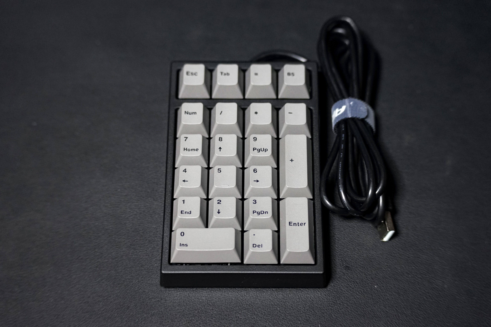
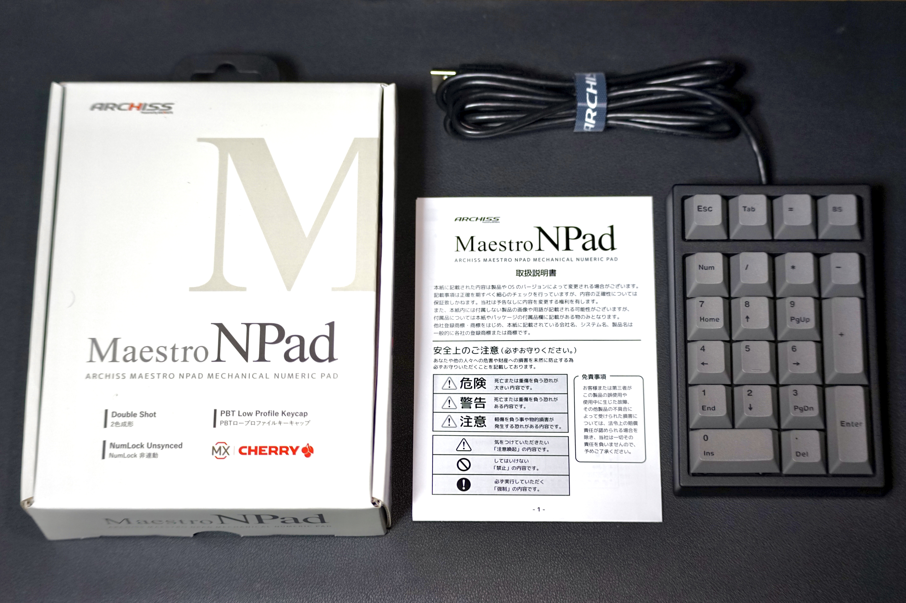
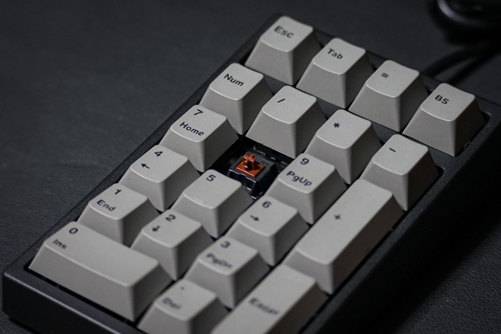
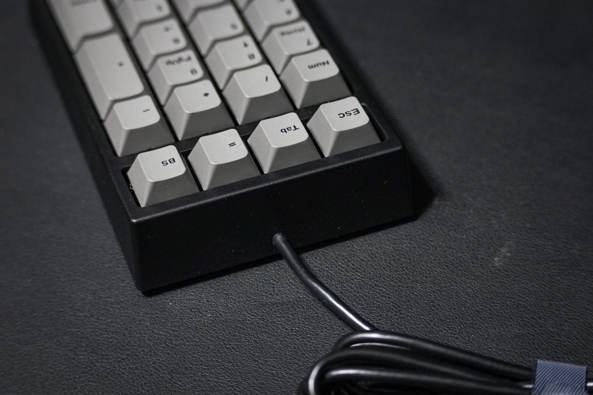
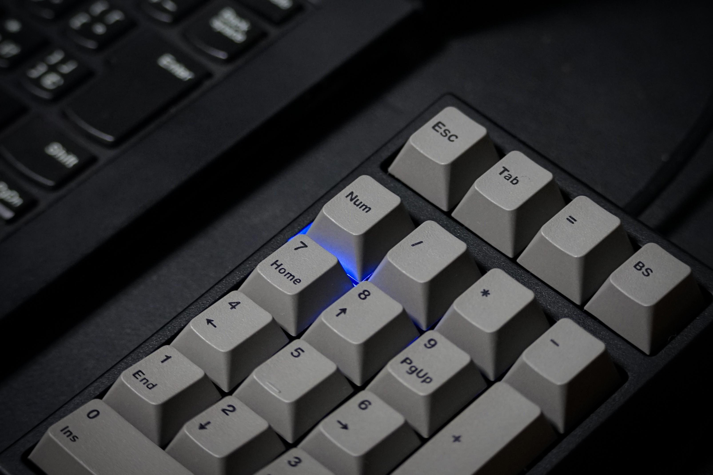
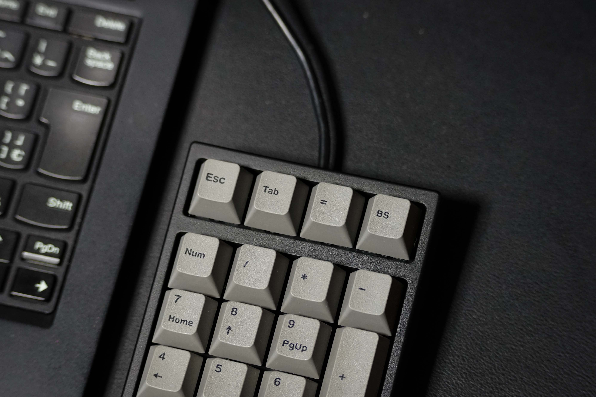
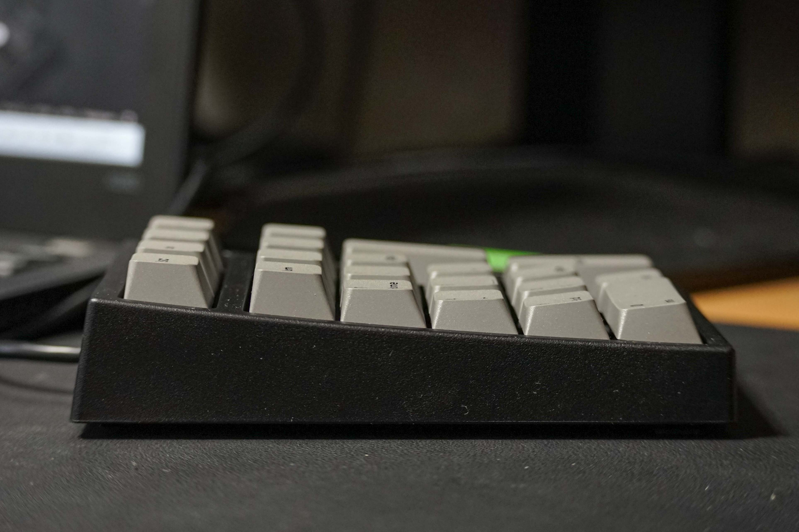
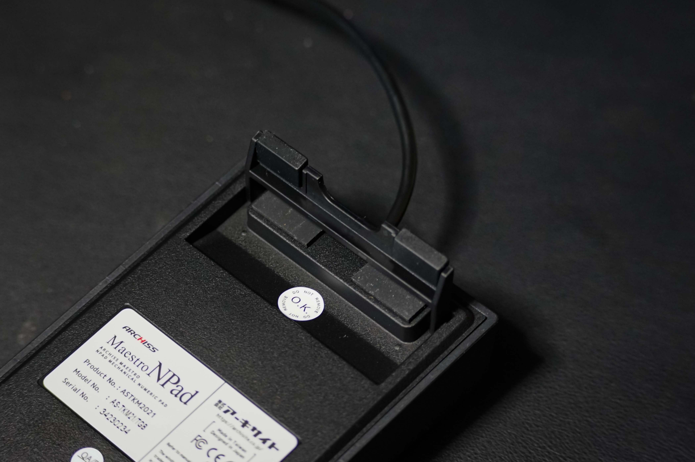
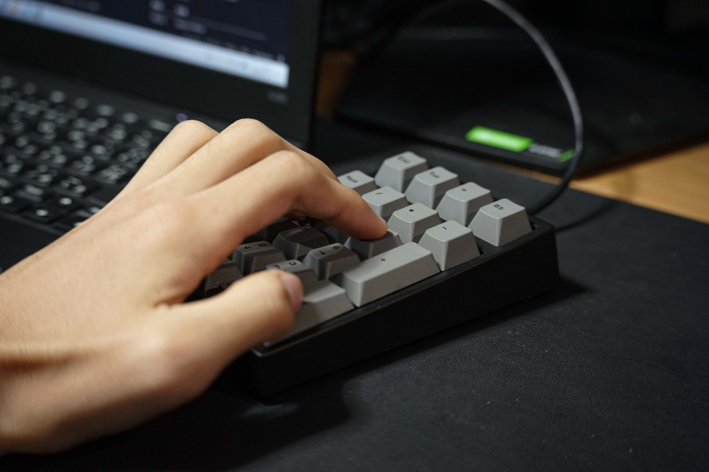
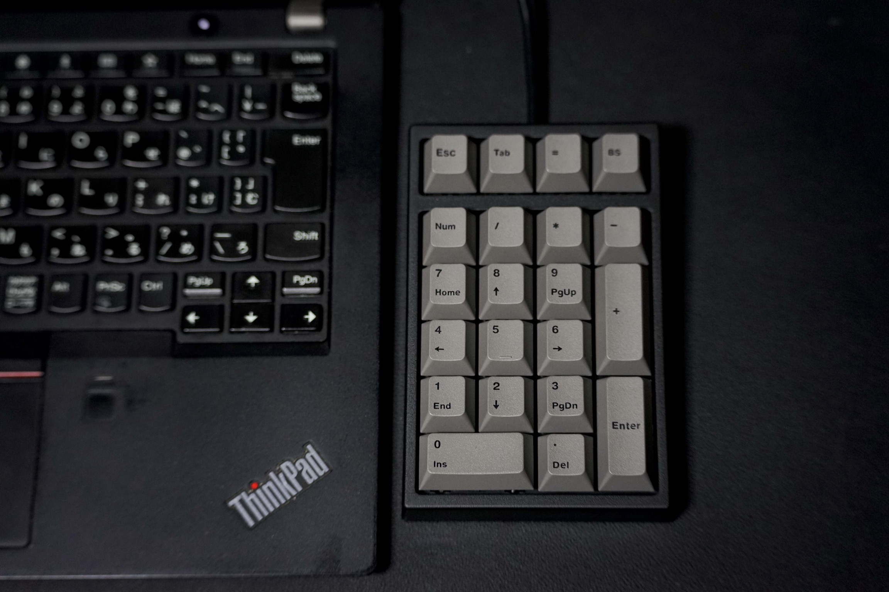

## はじめに

どうもこんにちはホシノです！  
最近、学校での授業や検定などでオフィス系ソフトを使うことが多くなり、パソコンで数字を入力する機会も多くなりました。  
ですが私が使っている ThinkPad にはテンキーがなくて、家でパソコンを使わなくてはいけない場面でとても不便でした。

そこで今回は、ARCHISS の Maestro NPad を購入したので紹介します。

## 商品概要

| 項目 | 仕様 |  
| :---- | :---- |
| 商品名 | Maestro NPad |
| キースイッチ | CHERRY MX スイッチ |
| キーピッチ | 19mm |
| 接続方式 | USB Type-A |
| サイズ | W：88 mm × D：136 mm × H：25~35 mm |
| 重量 | 290 g |
| キー数 | 21キー |
| 対応OS | Windows 10,11 |

このような仕様になっています。  
キースイッチは CHERRY MX 製のキーで「黒軸、茶軸、青軸、赤軸、静音赤軸、スピードシルバー軸、クリア軸」の中から選んで購入できます。

今回、私は茶軸を購入しましたので茶軸前提で紹介していきます。

### 付属品

まず付属品ですが、説明書と本体だけのシンプルな同梱物でした。

## Maestro NPadの特徴

+ CHERRY MX スイッチを搭載
+ 有線接続（脱着不可）
+ Windows 対応（MacOS 非対応）
+ NumLock 非連動タイプ
+ 表計算ソフトで便利なキー搭載

### CHERRY MXスイッチを搭載

前述でも紹介した通り、キースイッチは CHERRY MX 製のキースイッチを採用していて「黒軸、茶軸、青軸、赤軸、静音赤軸、スピードシルバー軸、クリア軸」の7つの中から選んで購入できます。

今回購入した「茶軸スイッチ」の仕様を紹介します。

| 項目 | 仕様 |
| :-| :-- |
| スイッチ特性 | タクタイル |
| キー荷重 | 55 g |
| 動作点 | 2.0 mm |
| キーストローク | 4.0 mm |
| 耐久性 | 5000 万回 |
| クリック音 | なし |

ちなみに説明書にも記載がない上、試してみた感じではホットスワップは対応していないようです。

### 有線接続（脱着不可）

PC との接続方法はUSBでの接続になります。
また、脱着可能なタイプではなくキーボード本体からケーブルが生えている仕様です。 
個人的には、ケーブルは脱着式がよかったなと思いました。

当たり前ですが、無線には"非対応"です。

### Windows 対応（MacOS 非対応）

今回紹介した Maestro NPad はWindows10,11 に対応しています。  
調べたところ MacOS では使えないと言っている方もいる為、残念ながら MacOS には対応していないようです。

### NumLock 非連動タイプ

Maestro NPad は NumLock 非連動タイプです。  
テンキーのついていないノートパソコンで使用する際、一部のパソコンではノートパソコンのNumLockと、外付けのテンキーが連動して不具合を起こしてしまう場合があります。  
そのような場合でも不便なく使えるのが非連動タイプです。

テンキーのついていないノートパソコンで使う場合は必須といってもいい機能でしょう。

### 表計算ソフトで便利なキー搭載

テンキー上段に右から Escape キー、Tab キー、＝キー、バックスペースキーがあります。

表計算ソフトでテンキーを使用して入力している際にタイプミスをすると、バックスペースキーを押すために移動が大きくなります。そんな時にテンキーにバックスペースキーがあるといいですよね。  
また、Tab キーなど表計算ソフトで地味にあるとありがたいキーが割り当てられています。  

## Maestro NPad（茶軸）のレビュー

+ タイピングしやすい
+ 打鍵感が良い
+ 打鍵時にわずかに金属反響音
+ Windows のみの対応

### タイピングしやすい

キーが階段状に段差が持たせるステップスカルプチャー構造になっていて、すべてのキーに手が届きやすいです。
また、一般的なキーキャップより背が低めのロープロファイルキーキャップになっていて、全体的にも背が低めの構造でノートパソコンと併用した時にも使いやすい感じがします。

裏面にはラバーストッパーが設置されたチルトスタンドがあり、公式ページにはチルトスタンドを立てた状態でも安定したタイピンが可能とありますが、個人的には立てないほうが打ちやすい気がします.

### 打鍵感が良い

今回、私は青軸のような音は鳴らないでほしいけど、赤軸のように軽い打鍵感も嫌だなと思い茶軸を選びました。

実は青軸、赤軸は今まで触ったことがあるのですが、茶軸は今まで触ったことがなかったので買うときはこれで大丈夫かなと不安になりました。
でも今回届いて触ってみて、正解だなと思いました。  
青軸のような打鍵感はないにしても、赤軸よりは打鍵感があり音もほぼないのでスコスコと打てます。
押下圧も 55 g で軽くはありませんが打った感じはそこまで重くもなく指が疲れにくいです。

### 打鍵時にわずかに金属反響音

メカニカルキーボードでよくある現象ですが、今回購入した Maestro NPad でも少しだけ金属反響音があります。

ですが、私はそれはメカニカルキーボードの宿命だと思っていますし、めちゃくちゃ静かな場所でもない限りそこまで目立たないので個人的にはいいと思います。  
ですが、打鍵音にこだわりを持っている方や、少しの金属反響音も許せない方は、購入を避けたほうが良いかもしれません。

### Windowsのみの対応

私は Windows PC しか持っていないので問題はありませんが Mac PC を使用している方は注意した方がいいです。  
ネットで調べたところ「Mac では使えない」と言っている方が一定数居るので、「大丈夫だろう」と購入するのはやめたほうがいいです。

しっかり使用できるか調べた上で購入することを強くお勧めします。

## まとめ

今回は ARCHISS の Maestro NPad を紹介しました。  
見ていただいた通り、少しの欠点はありますが全体的に見ればとても優れた製品です。  
テンキーが欲しいという方は、この Maestro NPad を購入検討してみてはいかがでしょうか。

### 最後にこんな方におすすめ！
+ テンキーが欲しいという方
+ ノートパソコンにつなげて使いたいという方
+ メカニカルスイッチのテンキーが欲しい方
+ Windowsで使う方
+ 表計算ソフトをよく使う方
