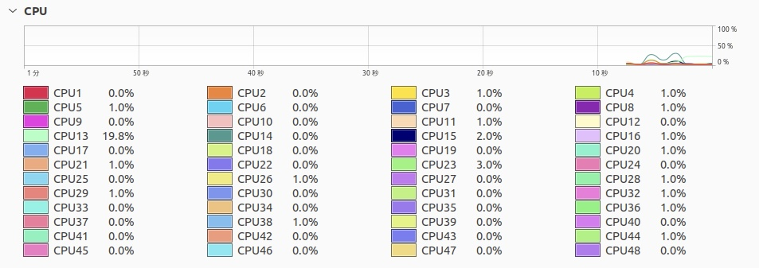

## はじめに
サーバー運営している中で誰しもが思うこと、それは「逸般の誤家庭を目指したい！！」だと思います(違)  
そんな思いを実現すべくラックサーバーを購入したので、メモ程度に備忘録として投稿します。

記事の中身には期待しないでね。

## ラックサーバーとは
まぁラックサーバーと聞いても＂一般人＂な人はなんぞやって感じですよね。  
そんな人の為に一応軽く説明します。  
（まぁこの記事を見てる時点で＂逸般人＂でしょうけども。）

ラックサーバーとは、一般的に売られているタワー型のパソコンとは違い、一箇所にまとめて設置するパソコン(サーバー)みたいな感じですね。  
大量のラックサーバーが一箇所に集合してできるのが、みなさんが想像するサーバールーム、データセンターってわけですね。

## 実際使ってみる

### 到着〜サーバー設置
実際持って思ったことですが、第一印象として「重くてデカい！！」ですね。  
非常に持ちにくかったです。  
宅配便で届いた時重くて自室まで持っていくのでさえ苦労しました。

自室に行って終わりではなく、設置作業があります。  
とりあえずは机の上に置いて動かしてみますが、まぁ「デカくて場所取るなぁ」と言った感じ。  
学生でラックサーバー買う時はお家の広さと相談してから買いましょう！

### サーバー起動〜運用開始

#### サーバー起動
仮設置も終わったのでサーバーを起動していきます。

ただ私はここが1番怖かったです。  
ラックサーバーは＂起動時にファン全開でうるさい＂というのを知っていたので、どれだけうるさいのか楽しみな反面怖かったです。

一応私も学生ですから家族がいます。  
サーバーの爆音で父親とかに「何やってんだオメー」ってキレられたらたまったもんじゃないですからね。

そんな怖さがありながらも電源をつけたら案の定爆音でした。  
＂部屋の外まで音が漏れてるんじゃないか＂と思って試しに外に出てみたのですが、案外うるさくない。

これなら家族の心配せずに添い寝できそう。  
※いつか高負荷時の爆音ファンで死ぬ

#### OSインストール
そんなこんなで起動したのでOSを入れていきます。

今回は実験も兼ねて入れやすいUbuntuDesktopを入れました。  
ただUSBをガチャリンコして待って少し操作すれば簡単にインストールできますからね。

特にトラブルもなく普通にインストールが完了しました。

#### 運用開始
自分はこれと言って動かしたいものがあるわけではないので、とりあえずOpenSSHを入れてメンバーが使えるようにしました。

多分みんな喜んでいるでしょう。  
※多分(ココ重要)

## 性能
ラックサーバーといえばXeon、Xeonといえば高性能  
てなわけで性能面についてのお話をしていきます。

今回のサーバーはヤフオクで落札したのですが、落札するまでに色んなラックサーバーを漁りました。

その探している中で思った事ですが、案外どれも8コアとかの少なめなコア数のサーバーが多かったです。  
まぁファイルサーバー、NASの使い方する場合はそんなに性能要らないですしね。

自分は＂数の暴力！！＂という事で12コアのCPUが2つ載ったラックサーバーを落札しました。

まぁ圧巻ですよね。  
非常に気持ちがいいです。

ここまで使う場面が果たして来るのか…。  
※多分来ません。

## 感想
まぁ、、、分かり切ってはいる話ですが、最初はタワー型PCをサーバーとして使うことをおすすめします。

明らかにいきなりラックサーバーは攻めてますからね。

普通とは違うことをしたい！！って人はラックサーバーから始めてもいいんじゃないでしょうか(？)

言いたい事はこれくらいです。  
みんなも逸般の誤家庭ライフを楽しみましょう。
