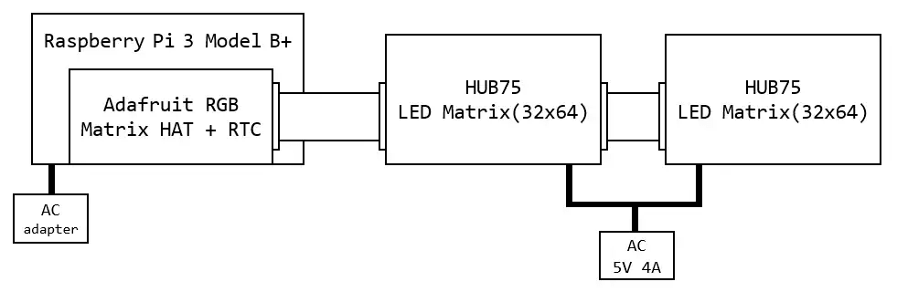
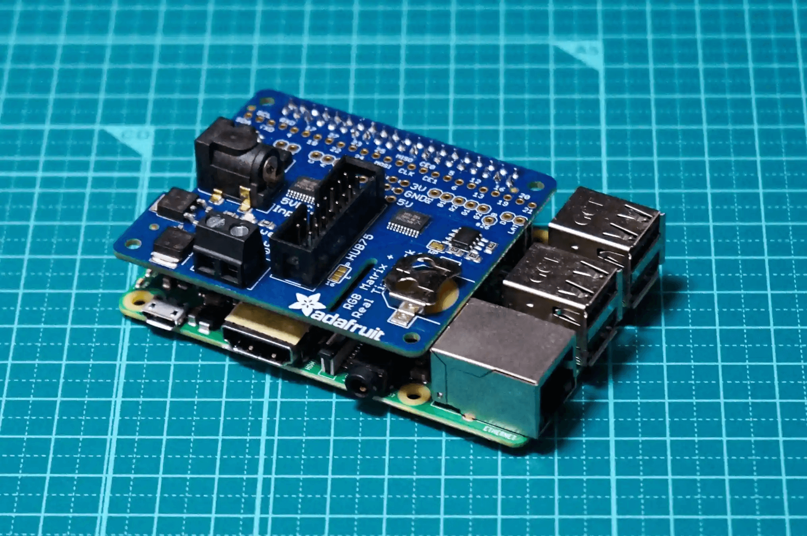

## はじめに

どうもこんにちはホシノです。

今回は、Raspberry Pi と LED マトリクスを使用して、JR 東日本 E233 系の行先表示器（側面）を作ったので紹介します。

行先表示器とはなんぞやという人に軽く説明すると、電車の横にある○○行きみたいなのを表示しているやつですね。  
別の呼び方だと方向幕とも呼ばれますね。  
（今回作るのは LED 方向幕）

## 構成



このような構成で制作しています。

今回の例では、AC 電源から直接 LED マトリクスに給電していますが、Adafruit RGB Matrix HAT + RTC を介しての給電もできそうです。

ちなみに Adafruit RGB Matrix HAT + RTC に電源刺さなくても、Raspberry Pi から電源を取って動作はしてくれるようです。  
※インターフェース基板 を介して LED マトリクスに給電する場合は、電源を繋ぐ必要がありそうです。

## 必要なもの

今回紹介する中には、はんだ付けが必要なものがあります。  
また、購入場所は投稿主が購入した場所です。参考程度で見てください。

| 必要部品 | 数量 | 購入場所 | 推定価格（円） |  
| ---- | :----: | ----: | ----: |
| LEDマトリクス 32×64 | 2 | Aliexpless | 4,000 |  
| Raspberry Pi | 1 | メルカリ | 5,000 |  
| Adafruit RGB Matrix HAT + RTC | 1 | Amazon | 4,000 |  
| AC 5V電源（4A以上） | 1 | Amazon | 1,500 |  
| 合計 | - | - | 14,500 |

ケーブルなどの基本付属するようなものは、上記には含んでいません。  
付属していないなどで必要であれば、追加で購入してください。

## 各部品の説明

### LED マトリクス
LED マトリクスといってもいろいろな種類がありますが、今回使用するのは、HUB-75 規格の 64×32 ドットのパネルです。

今回作る行先表示機は、128×32 ドットのため、64×32 では横方向のドットが足りないので2枚使用して、128×32 にします。

### Raspberry Pi
Raspberry Pi は、一枚の基板に CPU や入出力インターフェースがついている小型のマイコンボードです。

現在、Raspberry Pi には1～4のバージョンがありますが、購入する場合は最低でも Raspberry Pi 3 Model B 以上を選んだほうがいいと思います。

私は Raspberry Pi 3 Model B+ を選びました。

### Adafruit RGB Matrix HAT + RTC
Adafruit RGB Matrix HAT + RTC は、Raspberry Pi に接続して HUB-75 規格の LED マトリクスを制御できるインターフェース基板です。

日本だとマルツ電波や Amazon で購入ができます。

なお、コネクタ類ははんだ付けの必要があるので注意です。

### AC 5V電源（4A以上）
電源は Raspberry Pi と LED マトリクスに使用しますが、ここで挙げる電源は、LED マトリクスに使用する電源です。

LED マトリクスは 64×32 ドットだと、2A /枚が目安となっており、今回は2枚使用するので、4A 程度のものを用意したほうがよさそうです。

ただし、投稿主が試した際は、2.5A でも動作しましたので、3A くらいでも良いかもしれませんね。


## ハードウェアの準備

実際に組み立てを行っていきたいと思います。  
なお、このパートでは、はんだ付け等はされている前提で進めていきます。

#### Adafruit RGB Matrix HAT + RTCをRaspberry Pi につける

Raspberry Pi の GPIO と Adafruit RGB Matrix HAT + RTC の GPIO を合体させます。

間違った向きに付いたりするので注意してください。

:::div{.w-1/2.mx-auto}

:::

#### LEDマトリクスをRaspberry Piと接続する

LED マトリクスに付属している 16pin フラットケーブルを、LED マトリクス二枚同士とインターフェース基板の HUB75 のコネクタにつなぎます。

LEDマトリクスには入力用と出力用のコネクタに分かれています。  
基板にプリントされている矢印の向きにデータが流れるので、矢印が向いている先が出力用、その反対が入力用だと考えてください（パネルによってはプリントされていません）。

#### LEDマトリクスに5Vを流す

AC 5V 電源（4A 以上）からプラスマイナスを、取り付属した電源用ケーブルにつなぎます。

このときプラスマイナスを間違えるとLEDマトリクスの故障につながるので注意してください。  
テスターなんかで調べるといいでしょう。

#### Raspberry Piに各種ケーブルを接続する

HDMI ケーブルや LAN ケーブル、キーボード、マウスなどを接続する。

## ソフトウェアの準備

ソフトウェアの準備を進めます。  
Raspberry Pi に必要な Micro SD カードを準備してください。

### Raspberry Pi OSを導入する

今回は Raspberry Pi OS を導入しますが、既に導入している場合はここはスキップで構いません。  
また、導入方法は他の記事詳しく解説されてるので、ここではざっと説明します。

#### Imagerのインストール

お使いのPCで Raspberry Pi 公式サイトの[ダウンロードページ](https://www.raspberrypi.com/software/)から、お使いの OS（Windows,Mac,Ubuntu）から選択してimagerをインストールしてください。

#### Raspberry Pi OSをSDカードにインストール

1. 8GB 以上の Micro SD カードをPCに接続して、Raspberry Pi Imager を開いてください。

2. 「OS を選ぶ」から一番上の Raspberry Pi OS を選んでください。

3. 「ストレージを選ぶ」から先ほど接続した Micro SD カードを選択します。<br>書き込み先のストレージのデータはすべて削除されるので、間違えないように注意してください。

4. 「書き込む」をクリックしてください。<br>確認ダイアログが表示されるので「はい」を選択してください。

5. 「Raspberry Pi OS（32bit）は○○に書き込まれました。」と出れば成功です。

### flickLEDとrpi-rgb-led-matrixをインストール

#### flickLEDをクローンする

今回は、[acela86](https://github.com/acela86)さんの[flickLED](https://github.com/acela86/flickLED)をクローンするのですが、Python3では動作しません。  
Python2にダウングレードする方法もあるようですが、めんどくさいので今回は TGR Group の技術部の方が、flickLED を Python3 でも動くように書き換えてくれたので、それを使います。

下記のコマンドを実行し、Raspberry Pi にレポジトリをクローンします。
```bash
git clone https://github.com/TGR-Group/flickLED.git
cd flickLED
pip3 install -U -r requirements.txt
```
クローンしたディレクトリ内で下記のコマンドを実行し、Python のスクリプトファイルに実行権限を付与します。
```bash
sudo chmod u+x *.py
sudo chmod a+x ./cgi-bin/*.py
```


#### rpi-rgb-led-matrix をインストールする
Adafruitのサイトにある[Driving Matrices](https://learn.adafruit.com/adafruit-rgb-matrix-plus-real-time-clock-hat-for-raspberry-pi/driving-matrices)の `Step 6. Log into your Pi to install and run software` に沿ってインストールしていきます。

下記のコマンドを実行し、rpi-rgb-led-matrix をインストールします。
```bash
curl https://raw.githubusercontent.com/adafruit/Raspberry-Pi-Installer-Scripts/main/rgb-matrix.sh > rgb-matrix.sh
sudo bash rgb-matrix.sh
```

## ソフトウェアの実行

#### 起動させる
クローンしたディレクトリ内で下記のコマンドを実行し、ソフトウェアを起動させます。
```bash
sudo python3 app.py
```

起動すると［ 普通｜前橋 ］が表示されます。  

#### 操作する
WEBブラウザ上で、Raspberry Pi（ポート番号：8000）にアクセスすると、操作ができる画面に移動できます。（デフォルトURL：`http://raspberrypi.local:8000`）

## まとめ

今回は行先表示器を制作してみました。  
以前から X (Twitter) などで見かけて気になっていたので、今回制作することができてとてもうれしいです。

少しいじれば、他にも新たに幕を追加もできるのでみんなもやってみてね。  
また進展があれば別の記事で紹介します。
