## はじめに
昨年からRaspberry Piを使った電子工作を初めて、電気を扱う機械も増えました。

https://tgrgroup.jp/blog/posts/train-led/

ですが今までテスターを持っていなかった為、極性を調べたり電圧や電流を調べることができずテスターが欲しいと思っていました。

そこで今回はAmazonで比較的安く売られているVENLABのVM-600Aを購入したので紹介していきたいと思います。

ちなみに私は電子工作初心者ですし、テスターにもそこまで詳しくはないのでそこはご愛嬌を。

https://amzn.asia/d/aGwTyrY

## 紹介
この章ではテスターの紹介をします。

### 内容物
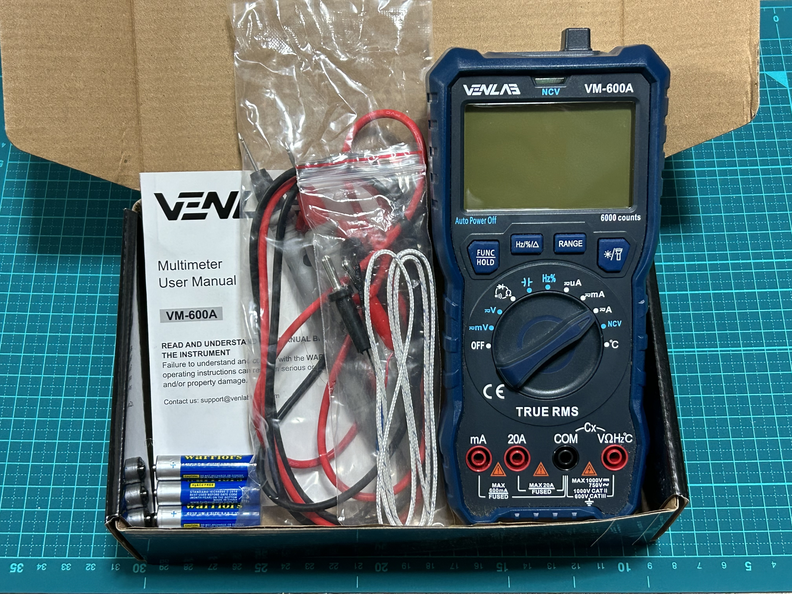
+ テスター本体
+ 計測用ケーブル
+ 温度測定用ケーブル(熱電対)
+ 電池
+ 予備ヒューズ
+ 説明書

予備のヒューズが入っているのは何気にありがたいですね。

### 機能
機能の紹介をします。

#### 測定機能
+ DC/AC電圧測定
+ DC/AC電流測定
+ 抵抗測定
+ NCV検出
+ 温度測定
+ 静電容量測定
+ 導通測定ダイオード測定
+ 周波数測定
+ デューティサイクル測定

ほぼ一般的なテスターと同じ機能ですがNCV検出がついているのはいいですね。

#### 便利機能
測定には関係ありませんが便利な機能がついています。
+ 懐中電灯
+ バックライト
+ 背面磁石
+ 背面折りたたみスタンド

懐中電灯・バックライトは暗い場所での作業に役に立ちます。  
また、背面の磁石・スタンドも金属のものがあればそこに付けて測れますし、安定したテーブルなどがあれば立てかけて測ることもできます。

### 外観
外観は全体的にカクカクしてゴツい印象です。
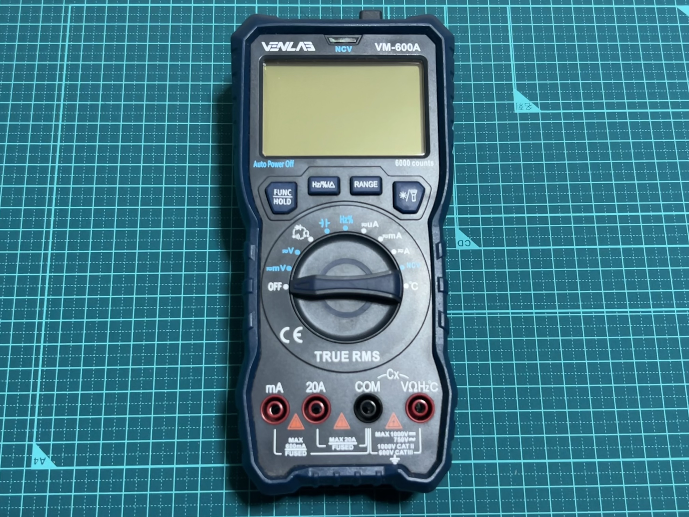
正面はこんな感じです。  
至って普通なレイアウトですね。
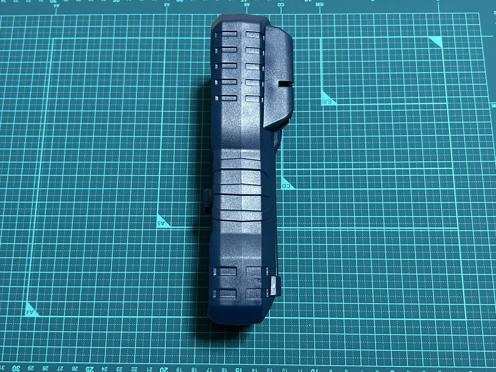
側面です。  
側面は特に何もないです。
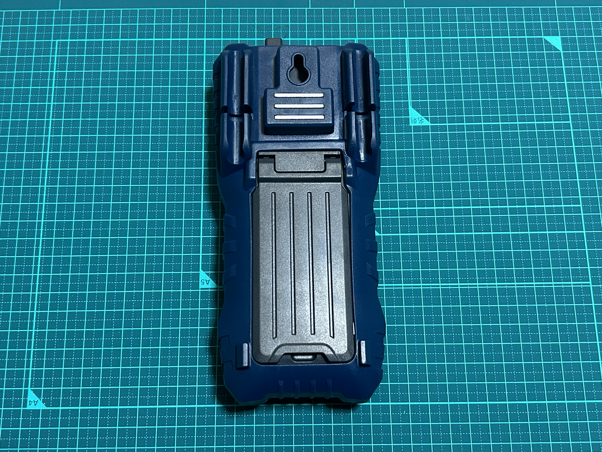
背面はこんな感じです。  
背面には測定用ケーブルの持ち手の部分が収納できるようになっています。  
また、先ほどの便利機能で挙げたように磁石とスタンドがあります。
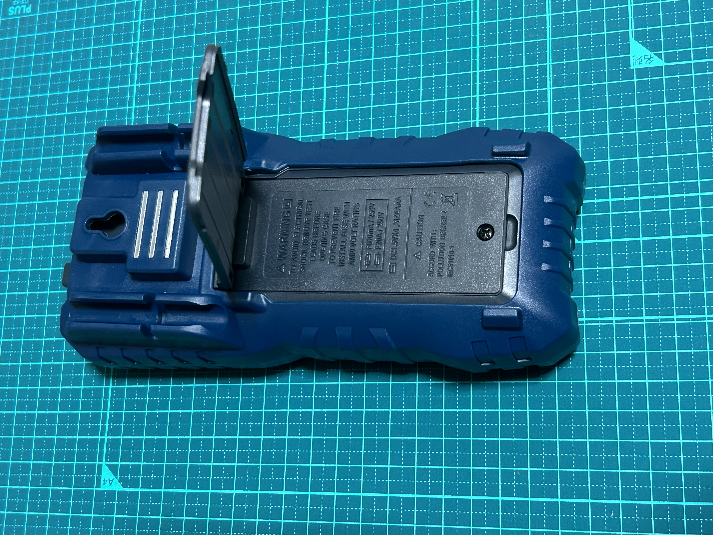
スタンドを開けるとネジがあって、外すと電池を入れるスペースがあります。  
ちなみにヒューズはここからは交換できないようで、分解しないとダメそうです。

### 実際に使ってみる
この章では実際に使ってみたいと思います。  
全部の機能は試せないので一部機能だけ使用してみます。
+ 電圧測定
+ NVC検出
+ 温度測定
+ 懐中電灯／バックライト

#### 電圧
まずはコンセントに挿して交流100Vを測ってみます。
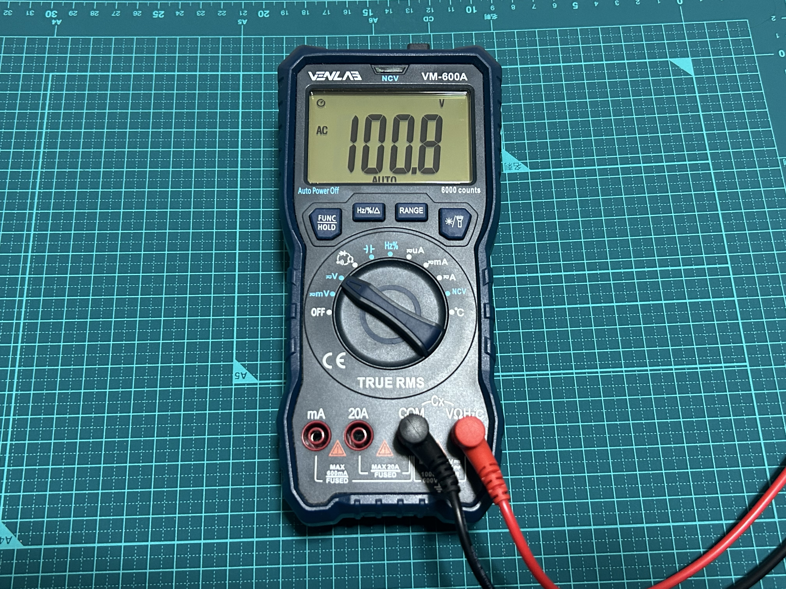
100.8Vと出ましたね。  
コンセントの電圧は100Vピッタリではないので正確な誤差は分かりませんが、100Vとの誤差は0.8Vなので許容範囲だと思います。

#### NCV検出
このNCV検出という機能、最初はなんだこの機能と思っていました。  
でも調べると電気が流れてるか流れてないかを判断することができる機能だそうで意外と使えそうな印象でした。

それでは実際に使ってみます。
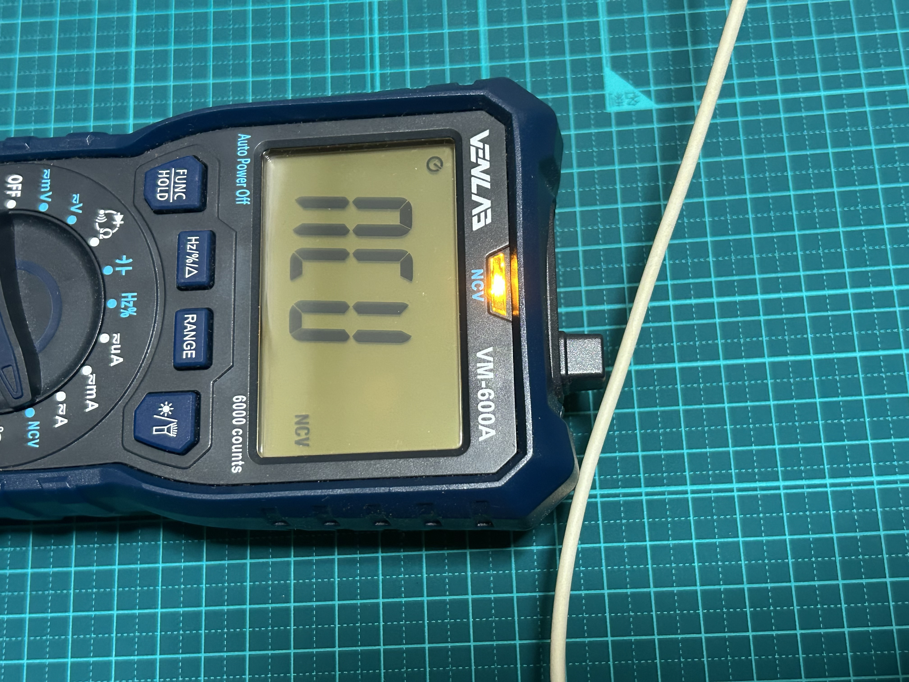
電気の流れてるケーブルにかざしたら「ピーピー」という音と共に上のLEDが光りました。  
電気の流れてる箇所にかざすと反応するので性能はバッチリのようです。
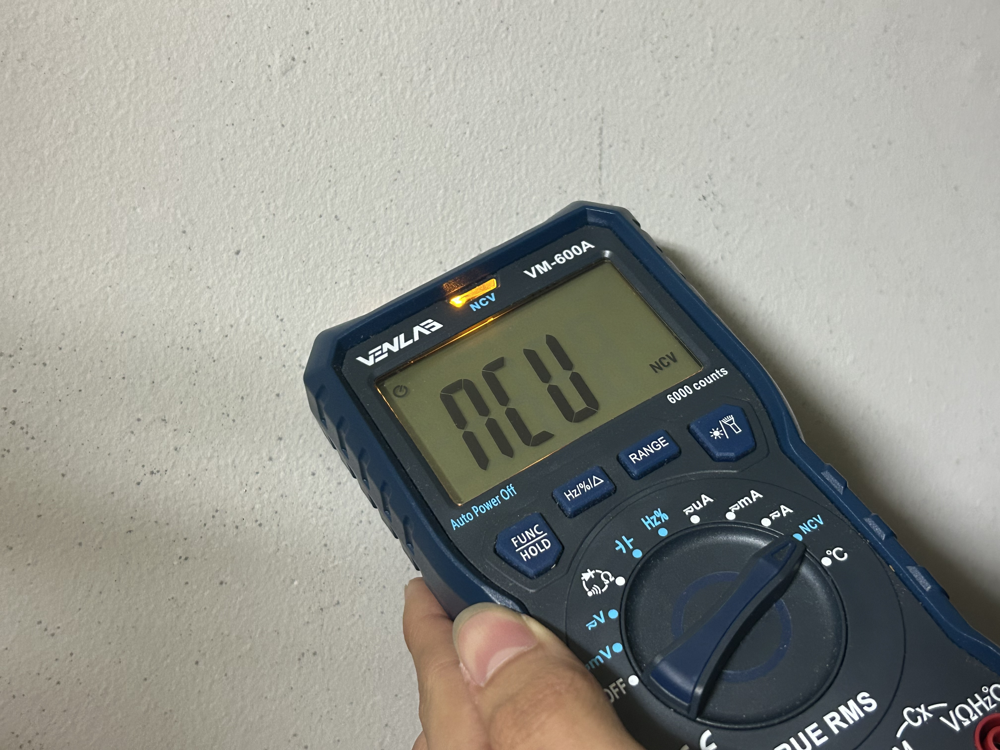
一応壁にもかざしてみました。  
場所によってはNCVが反応します。  
壁の中にケーブルが通っているのかな？

#### 温度検出
冷凍庫に突っ込んで温度が下がるか実験してみます。
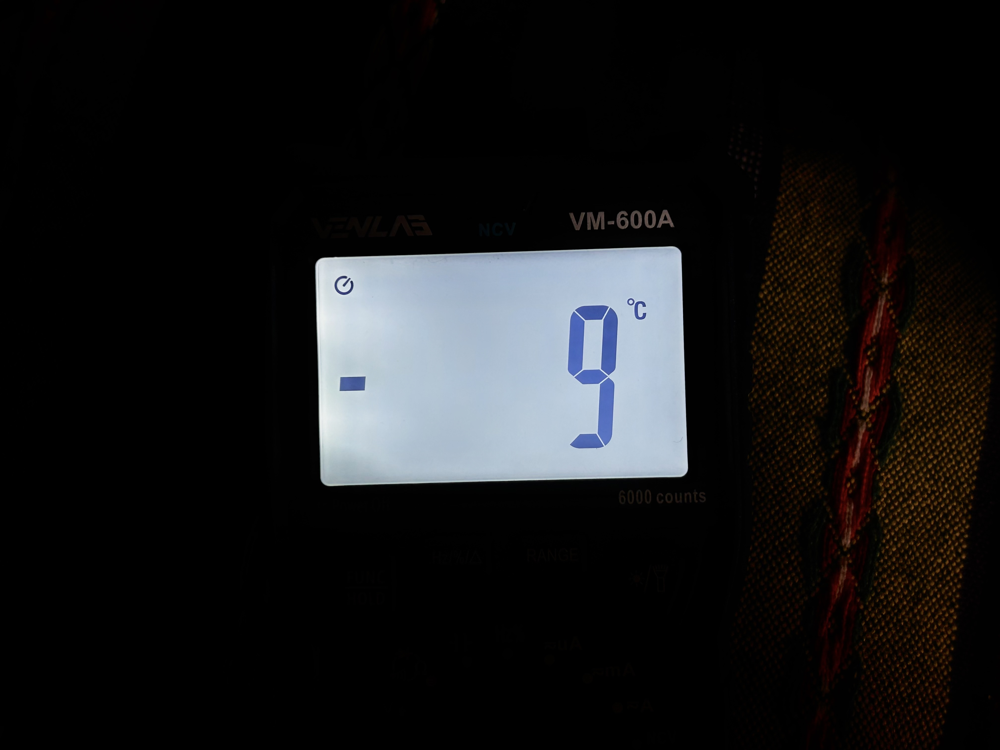
-9°Cまで下がりました。  
しっかり温度は測れていそうですね。

#### 懐中電灯／バックライト
次にバックライトをつけて実験してみようと思います。
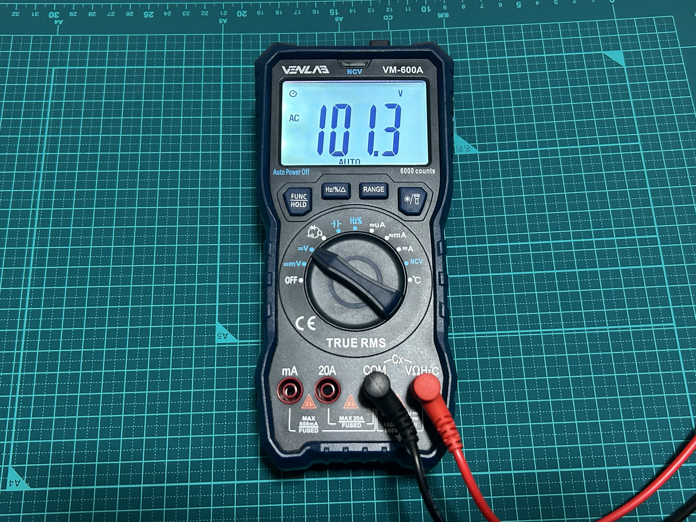
かなり明るくなり、暗闇での作業でも役に立ちそうですね。
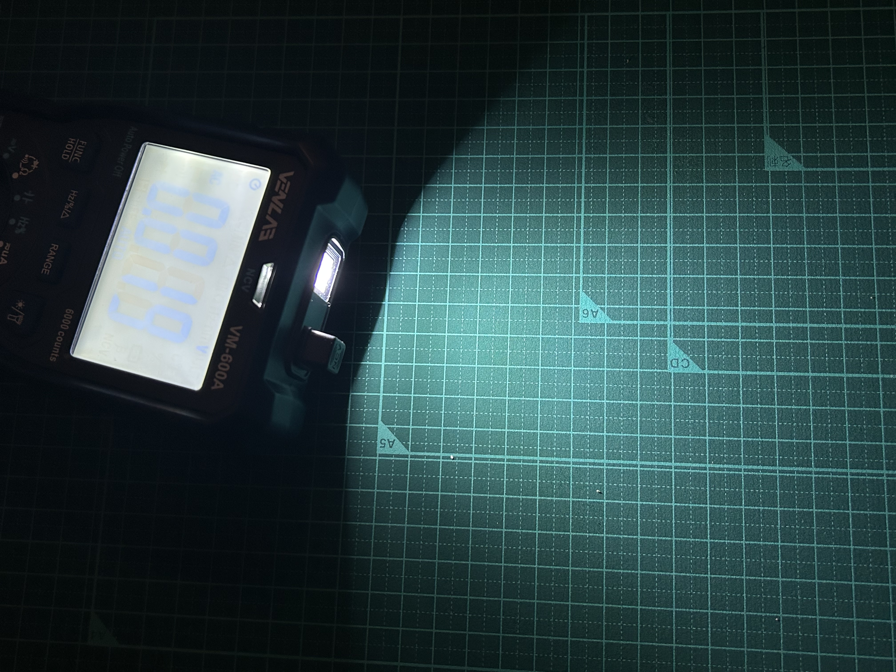
懐中電灯も試しましたが十分に明るく、これなら暗闇でも配線をしっかりと捉えることができそうです。

## まとめ
今回はVENLABの6000カウンター、VM-600Aを取り上げました。  
見た目も紺色で派手ではないけれどカクカクしていてかっこいいですし、使いやすさもダイヤル式のスイッチで簡単に操作ができます。  
また機能面でも十分実用性があります。  
今回は4種類とかなり少なめの機能だけを実際に使用して取り上げましたが、他にもいろいろな機能があります。  
テスターの基本的な機能をはじめ、便利な機能もあります。  
ぜひ購入して使ってみてください。　　
